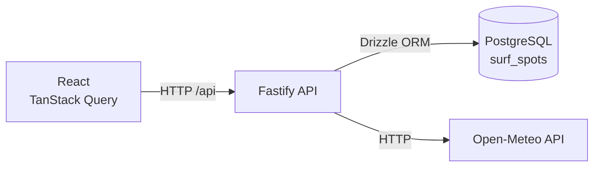
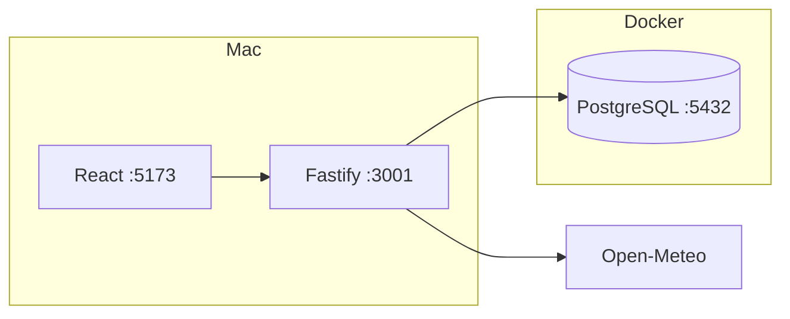

# Surf Window Architecture

## Application architecture



### Responsibilities

- **React** — renders the UI and requests forecast data.
- **TanStack Query** — handles API requests, caching and loading/error state.
- **Fastify** — provides the backend HTTP API.
- **Drizzle** — provides typed database queries and migrations.
- **PostgreSQL** — stores surf spot data.
- **Open-Meteo** — provides marine forecast data.

## Local development



During normal development, React and Fastify run locally for fast hot-reloading, while PostgreSQL runs in Docker.


# Surf Window Architecture

## Application architecture

```text
┌──────────────────┐
│ React            │
│ TanStack Query   │
└────────┬─────────┘
         │ HTTP
         ▼
┌──────────────────┐
│ Fastify API      │
└────────┬─────────┘
         │
         ├── Drizzle ─────► PostgreSQL
         │
         └── HTTP ────────► Open-Meteo
```

## Local development

```text
YOUR MAC                         DOCKER
────────────────────            ───────────────

React :5173
     │
     ▼
Fastify :3001 ────────────────► PostgreSQL :5432
     │
     ▼
Open-Meteo
```