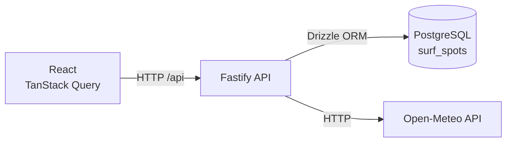

# Surf Window Architecture

## Application architecture



### Responsibilities

- **React** — renders the user interface.
- **TanStack Query** — fetches and caches server data and manages loading/error state.
- **Fastify** — exposes the HTTP API and coordinates backend operations.
- **Zod** — validates API contracts, external responses and environment configuration.
- **Drizzle ORM** — provides typed PostgreSQL queries, schema definitions and migrations.
- **PostgreSQL** — stores surf spot data.
- **Open-Meteo** — provides marine forecast data.
- **Vitest** — tests API behaviour with mocked external/database boundaries.
- **nginx** — serves the production React build and proxies `/api` requests when running in Docker.

## Local development
```text

 MAC                                  DOCKER
────────────────────                  ─────────────────

React :5173
     │
     ▼
Fastify :3001 ──────────────────────► PostgreSQL :5432
     │
     ▼
Open-Meteo
```

During normal development:

- React runs locally with Vite.
- Fastify runs locally with `tsx watch`.
- PostgreSQL runs in Docker.
- Fastify connects to PostgreSQL via `localhost:5432`.

# Surf Window Architecture

## Application architecture

```text
┌──────────────────────┐
│ React                │
│ TanStack Query       │
└──────────┬───────────┘
           │ HTTP
           ▼
┌──────────────────────┐
│ Fastify API          │
│                      │
│ GET /api/spots       │
│ GET /api/spots/:id/  │
│ forecast             │
└───────┬────────┬─────┘
        │        │
        │        └──────── HTTP ────────► Open-Meteo
        │
        └──────── Drizzle ORM ─────────► PostgreSQL
                                         │
                                         └── surf_spots

                                         
```
 ## Loading surf spots

```text
React
  ↓
TanStack Query
  ↓
GET /api/spots
  ↓
Fastify
  ↓
getAllSpots()
  ↓
Drizzle
  ↓
PostgreSQL
  ↓
surf_spots
```

## Loading surf forecast

```text
React
  ↓
GET /api/spots/:spotId/forecast
  ↓
Fastify route
  ↓
getSpotById()
  ↓
Drizzle
  ↓
PostgreSQL
  ↓
spot coordinates
  ↓
forecast service
  ↓
Open-Meteo client
  ↓
Open-Meteo Marine API
```

## Full Docker setup

```text
Browser
   │
   ▼
localhost:8080
   │
   ▼
nginx / React
   │
   ├──── /api ─────► Fastify
   │                   │
   │                   ├────► PostgreSQL
   │                   │
   │                   └────► Open-Meteo
```

Inside Docker Compose:
- `web` serves the React application through nginx.
- `api` runs the compiled Fastify application.
- `db` runs PostgreSQL.
- Containers communicate using Docker Compose service names such as `api` and `db`.